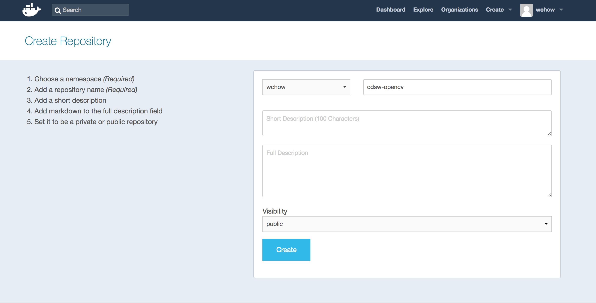
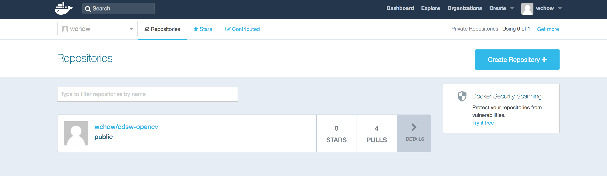
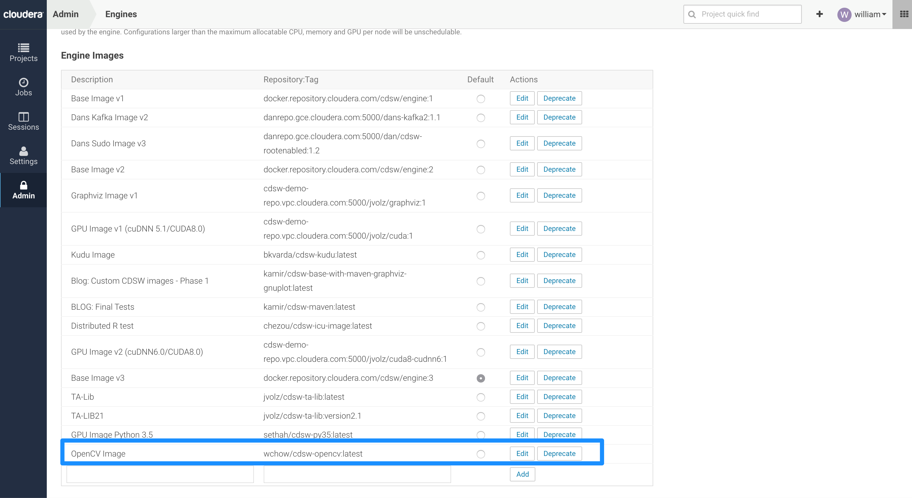
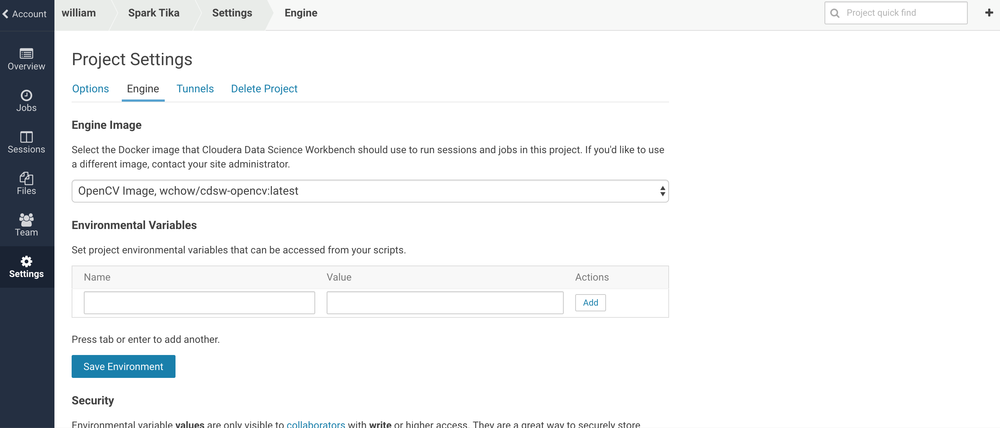
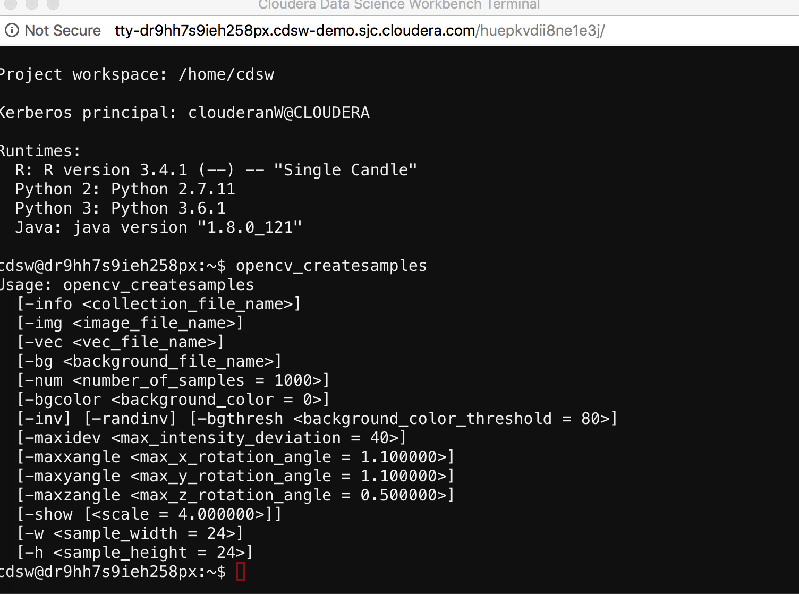

# Custom CDSW Engine Image with OpenCV

Creating a custom CDSW engine image that includes OpenCV 

## OpenCV

OpenCV (Open Source Computer Vision Library: http://opencv.org) is an open-source library that includes several hundreds of computer vision algorithms

Officially launched in 1999, the OpenCV project was initially an Intel Research initiative to advance CPU-intensive applications

The library is cross-platform and free for use under the open-source BSD license
OpenCV supports a wide variety of programming languages such as C++, Python (OpenCV-Python), Java, Scala, etc.

## Prerequisites
Install Docker :)

https://docs.docker.com/docker-for-mac/install/

### 1) Get Docker ID and login
Signup for an account here: https://hub.docker.com/
```
$ docker login --username=<your username>
```

### 2) Create your public repository in Docker Hub


### 3) Create Dockerfile
```
# Dockerfile
FROM docker.repository.cloudera.com/cdsw/engine:3

# update packages and install maven
RUN apt-get update && \
    apt-get install -y -q build-essential && \
    apt-get install -y -q cmake libgtk2.0-dev pkg-config libavcodec-dev libavformat-dev libswscale-dev && \
    apt-get install -y -q python-dev python-numpy libtbb2 libtbb-dev libjpeg-dev libpng-dev libtiff-dev libjasper-dev libdc1394-22-dev && \
    apt-get install -y -q libopencv-dev && \
    apt-get install -y -q python-opencv && \
    apt-get clean && \
    rm -rf /var/lib/apt/lists/*
```

### 4) Build the image with the Dockerfile.
```
$ docker build -t wchow/cdsw-opencv:latest . -f Dockerfile
```

### 5) Check that the image is there
```
$ docker images
REPOSITORY                                   TAG                 IMAGE ID            CREATED             SIZE
wchow/cdsw-opencv                          latest              3d69bf649ecc        24 minutes ago      6.1GB
docker.repository.cloudera.com/cdsw/engine   3                   e943800ce545        5 months ago        6.1GB
```

### 6) Run it to test it out
```
$ docker run -t -i wchow/cdsw-opencv
```

### 7) Push the image to Docker Hub
```
$ docker push wchow/cdsw-opencv:latest
```
In Docker Hub



### 8) Whitelist the image in CDSW


### 9) Make the whitelisted image available to your project


### 10) Test it out


